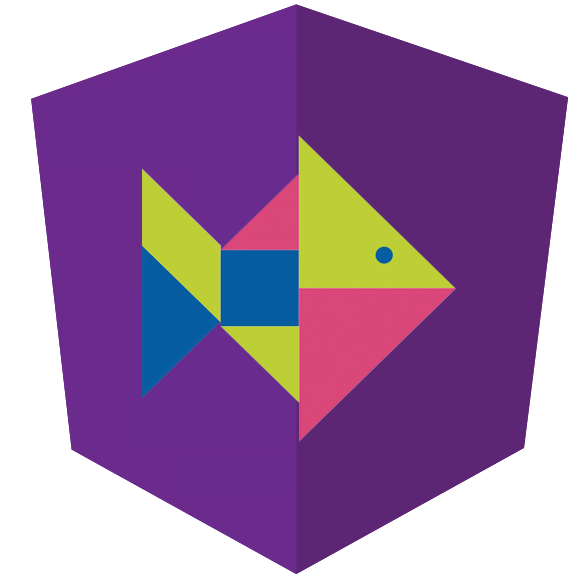

# NiceFish（美人鱼）

NiceFish是一个系列教学项目，都是Angular这个技术栈。

- NiceFish：美人鱼，这是一个微型Blog系统，前端基于Angular 4.x + PrimeNG。http://git.oschina.net/mumu-osc/NiceFish/

- NiceFish-Admin：这是系统管理界面，基于Angular 4.x+PrimeNG，http://git.oschina.net/mumu-osc/NiceFish-Admin

- NiceFish-ionic：这是一个移动端的demo，基于ionic。http://git.oschina.net/mumu-osc/nicefish-ionic

- NiceFish-SpringMybatis：这是Java版后台服务，http://git.oschina.net/mumu-osc/NiceFish-SpringMybatis 
 
 

## 用法

用git克隆本项目，从命令行进入进入项目根目录，依次执行以下命令：

	npm i -g cnpm --registry=https://registry.npm.taobao.org
	cnpm i -g @angular/cli
	cnpm install
	ng serve

如果之前装过angular-cli需要先卸载：npm uninstall -g angular-cli
如果之前装过@angular/cli需要先卸载：npm uninstall -g @angular/cli
如果你之前已经尝试安装过node模块，请把NiceFish根目录下的node_moduels目录删掉
然后依次执行以下命令：

	npm cache clean
	npm prune
	npm i -g cnpm --registry=https://registry.npm.taobao.org
	cnpm i -g @angular/cli
	cnpm install
	ng serve

打开你的浏览器，访问http://localhost:4200/
 

 项目 贡献者  大漠穷秋 
https://gitee.com/mumu-osc/
 开源许可证
MIT

你可以随意使用此项目，无需通知我，因为我可能很忙没空搭理你